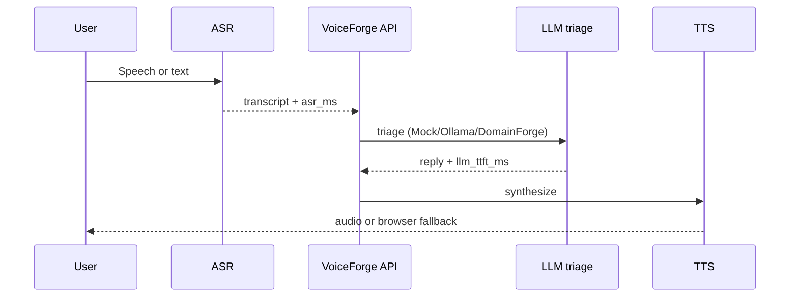

# VoiceForge — Real-Time Voice Triage


<!-- vpeetla-tech-stack:start -->
[]() []() []() []() []() []()
<!-- vpeetla-tech-stack:end -->
## Agent skills (Cursor + Codex)

Org skills: [vpeetla-ai-skills](https://github.com/vpeetla-ai/vpeetla-ai-skills). This repo includes `.cursor/skills/`, `AGENTS.md`, and `CONTEXT.md`.

```bash
git clone https://github.com/vpeetla-ai/vpeetla-ai-skills.git
./vpeetla-ai-skills/scripts/install.sh --cursor --codex --project .
```

---

[](https://voiceforge-assistant.vercel.app)
[](https://voiceforge-api-eysb.onrender.com/health)
[](LICENSE)

**Real-time voice triage** — ASR → LLM → TTS with latency budgets, WebSocket streaming, and graceful degradation.

Closes **Portfolio Pillar 5** (Real-Time Multimodal / Voice) for the [vpeetla-ai](https://github.com/vpeetla-ai) org.

[▶ Live demo](https://voiceforge-assistant.vercel.app) · [API health](https://voiceforge-api-eysb.onrender.com/health) · [Case study](https://github.com/vpeetla-ai/ai-architecture-portfolio/blob/main/case-studies/voiceforge-assistant.md)

**Portfolio:** [Case study](https://github.com/vpeetla-ai/ai-architecture-portfolio/blob/main/case-studies/voiceforge-assistant.md) · [ADR-021](https://github.com/vpeetla-ai/ai-architecture-portfolio/blob/main/adr/ADR-021-voiceforge-multimodal-pipeline.md) · [Repo ADR-001](docs/adr/ADR-001-voice-pipeline.md)

## What this is

**VoiceForge** is a governed **voice interface layer** for IT/support triage: measurable latency per phase (ASR, LLM TTFT, TTS), with honest fallbacks when any step exceeds budget or fails.

## How we solve it

| Problem | Approach |
|---------|----------|
| Voice demos hide failure modes | Explicit `DegradationReason` + UI waterfall |
| TTFT dominates UX | Per-phase budgets + `llm_ttft_ms` tracking |
| Free-tier can't run GPU ASR | Browser Web Speech API default; server Whisper optional |
| Triage must be structured | Pluggable LLM: Mock / Ollama / **DomainForge** `/v1/query` |

## Architecture

Canonical: [`docs/diagrams/canonical-architecture.mmd`](docs/diagrams/canonical-architecture.mmd)



| Layer | Default (Render free) | Upgrade |
|-------|----------------------|---------|
| ASR | Browser Web Speech API | `faster-whisper` server |
| LLM | Mock triage JSON | Ollama / DomainForge API |
| TTS | `edge-tts` | Browser `speechSynthesis` fallback |
| Transport | REST `/v1/voice` | WebSocket `/ws/voice` |

## Honest status

| Component | Status | Notes |
|-----------|--------|-------|
| Browser ASR + text fallback | ✅ | Client-side `asr_ms` to server |
| Mock / Ollama / DomainForge LLM | ✅ | `LLM_MODE` env |
| Edge TTS + browser fallback | ✅ | `pip install -e ".[tts]"` |
| Latency waterfall UI | ✅ | ASR / LLM / TTS / total |
| WebSocket phases | ✅ | `/ws/voice` |
| Replay last turn | ✅ | `/v1/replay` |
| Graceful degradation | ✅ | text, browser TTS, cache |
| Server Whisper on Render | ⬜ | Optional GPU host |
| AegisAI gate before TTS | ⬜ Planned | Regulated demos |

## Quick start

```bash
cp .env.example .env
pip install -e ".[dev,tts,api]"
make serve          # http://localhost:8000
pytest -q

cd ui && npm install && NEXT_PUBLIC_API_URL=http://localhost:8000 npm run dev
```

```bash
curl -X POST http://localhost:8000/v1/voice \
  -H 'Content-Type: application/json' \
  -d '{"transcript":"VPN keeps disconnecting","asr_ms":420}'
```

## Deploy

| Target | Config |
|--------|--------|
| API (Render) | [voiceforge-api-eysb.onrender.com](https://voiceforge-api-eysb.onrender.com) — cold start ~30s |
| UI (Vercel) | `ui/` static export · `NEXT_PUBLIC_API_URL` |

> **First-run note:** The Render API sleeps after inactivity on the free tier. The first request takes ~30s to wake. The UI shows a phase status and degrades gracefully to text-only if ASR/TTS or the API is unavailable.

See [docs/DEPLOYMENT.md](docs/DEPLOYMENT.md).

## Stack fit

**Layer:** Voice / Multimodal (Pillar 5) · Consumes [DomainForge](https://github.com/vpeetla-ai/domainforge-rag-peft) triage · Future [AegisAI](https://github.com/vpeetla-ai/aegisai-enterprise-agent-platform) TTS gate.

## License

MIT
